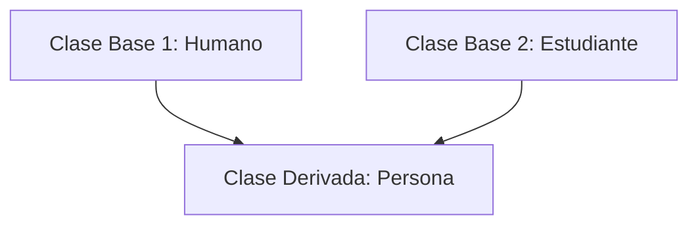
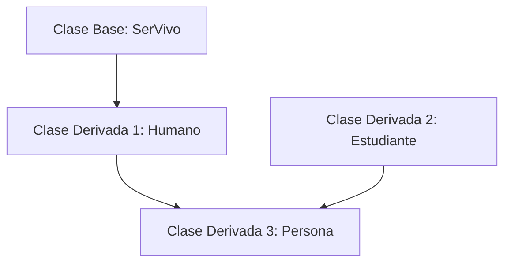

# Herencia en C++

La herencia, en programación orientada a objetos, es un mecanismo que permite crear una nueva clase (clase derivada o subclase) basada en una clase existente (clase base o superclase). La clase derivada hereda los atributos y métodos de la clase base, lo que facilita la reutilización del código y la creación de jerarquías de clases.

## Sintaxis de la herencia

En C++, la herencia se especifica utilizando el operador de dos puntos (`:`) seguido del modificador de acceso (`public`, `protected` o `private`) y el nombre de la clase base. La sintaxis general es la siguiente:

```cpp
class ClaseDerivada : [modificador_de_acceso] ClaseBase {
    // Miembros adicionales de la clase derivada
};
```

## Ejemplo de herencia

```cpp
#include <iostream>
using namespace std;

// Clase base
class Animal {
public:
    void comer() {
        cout << "El animal está comiendo." << endl;
    }
};

// Clase derivada
class Perro : public Animal {
public:
    void ladrar() {
        cout << "El perro está ladrando." << endl;
    }
};

int main() {
    Perro miPerro;
    miPerro.comer(); // Método heredado de la clase Animal
    miPerro.ladrar(); // Método de la clase Perro

    return 0;
}
```

En este ejemplo, la clase `Perro` hereda de la clase `Animal`. Esto significa que `Perro` tiene acceso al método `comer()` definido en `Animal`, además de su propio método `ladrar()`.

## Herencia múltiple

El ejemplo anterior muestra una herencia simple, donde una clase deriva de una sola clase base. C++ también soporta la herencia múltiple, donde una clase puede heredar de múltiples clases base.



Ejemplo de herencia múltiple:


```cpp
#include <iostream>
using namespace std;

// Clase base 1
class Humano {
public:
    void hablar() {
        cout << "El humano está hablando." << endl;
    }
};  
// Clase base 2
class Estudiante {
public:
    void estudiar() {
        cout << "El estudiante está estudiando." << endl;
    }
};

// Clase derivada que hereda de ambas clases base
class Persona : public Humano, public Estudiante {
};

int main() {
    Persona p;
    p.hablar();   // Método heredado de Humano
    p.estudiar(); // Método heredado de Estudiante

    return 0;
}
```

Con esto podemos ver cómo la clase `Persona` hereda métodos de ambas clases base, `Humano` y `Estudiante`. Es posible heredar los métodos de una clase que esté heredando de otras clases, conocido como herencia en cadena. Cuando se usa herencia multiple y herencia en cadena, se denomina herencia híbrida.



## Modificadores de acceso en la herencia

Los modificadores de acceso (`public`, `protected` y `private`) determinan cómo los miembros de la clase base son accesibles en la clase derivada:
- `public`: Los miembros públicos de la clase base permanecen públicos en la clase derivada.
- `protected`: Los miembros públicos y protegidos de la clase base se convierten en protegidos en la clase derivada.
- `private`: Todos los miembros de la clase base (públicos, protegidos y privados) se convierten en privados en la clase derivada.

## Consideraciones sobre la herencia

- La herencia puede aumentar la complejidad del código, por lo que debe usarse con cuidado.
- Es importante entender los modificadores de acceso (`public`, `protected`, `private`) y cómo afectan la visibilidad de los miembros heredados.
- La herencia debe utilizarse para modelar relaciones "es-un" (is-a) entre clases.

