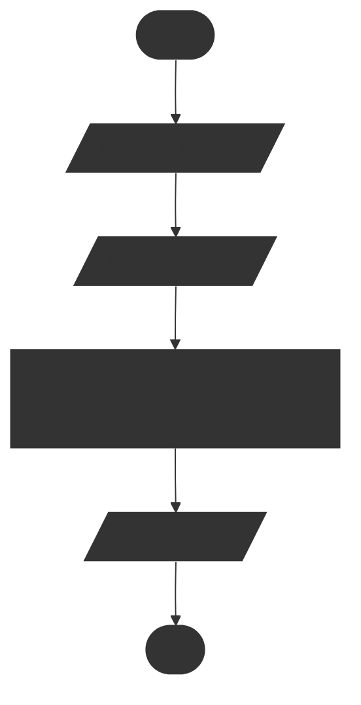
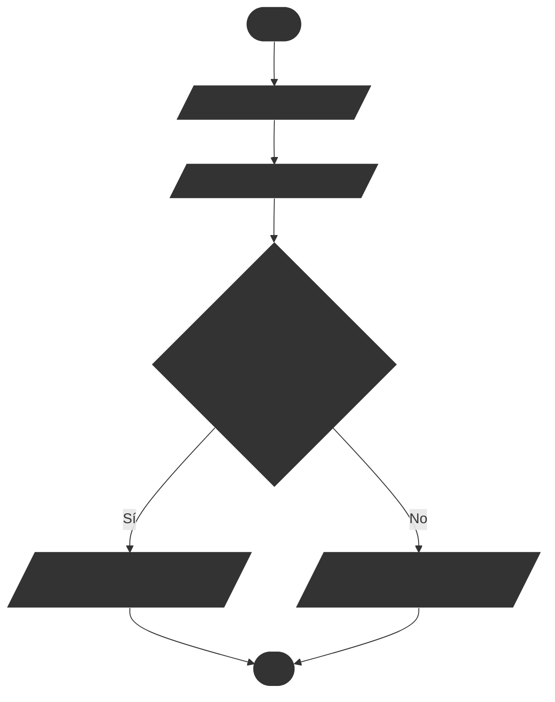
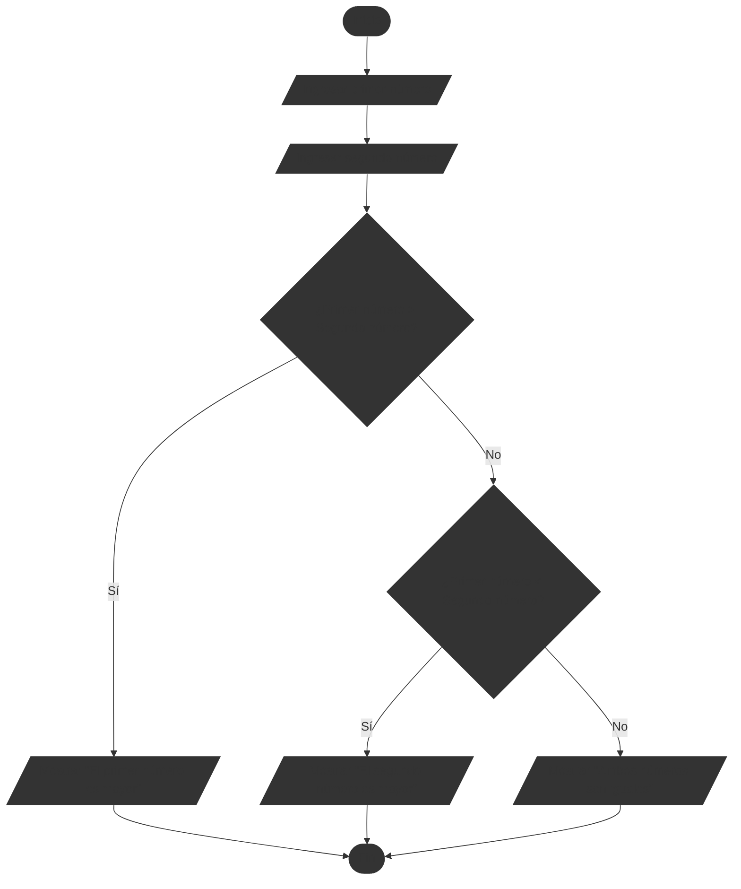
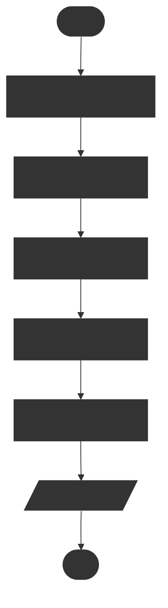
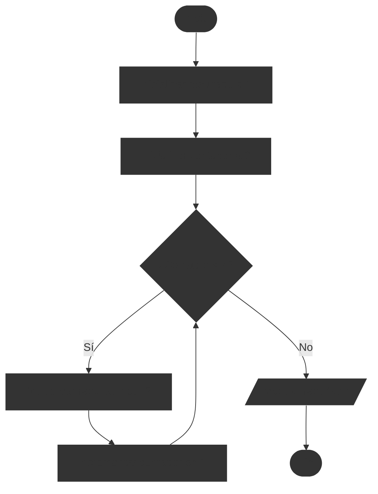
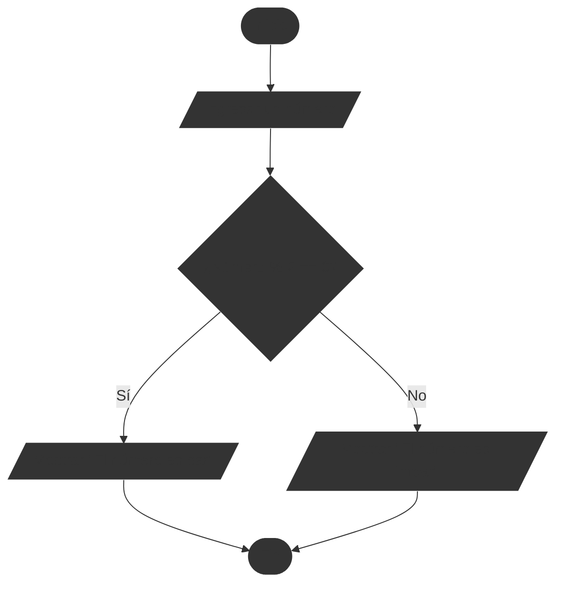
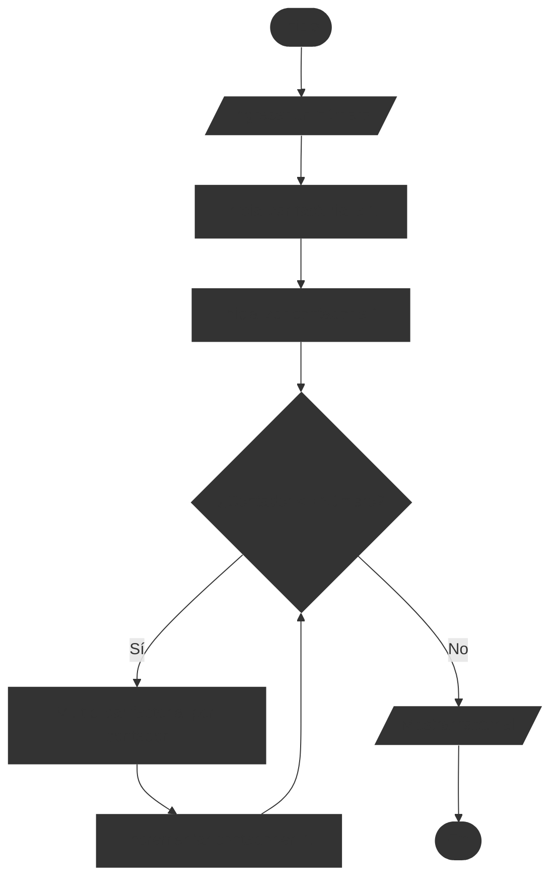
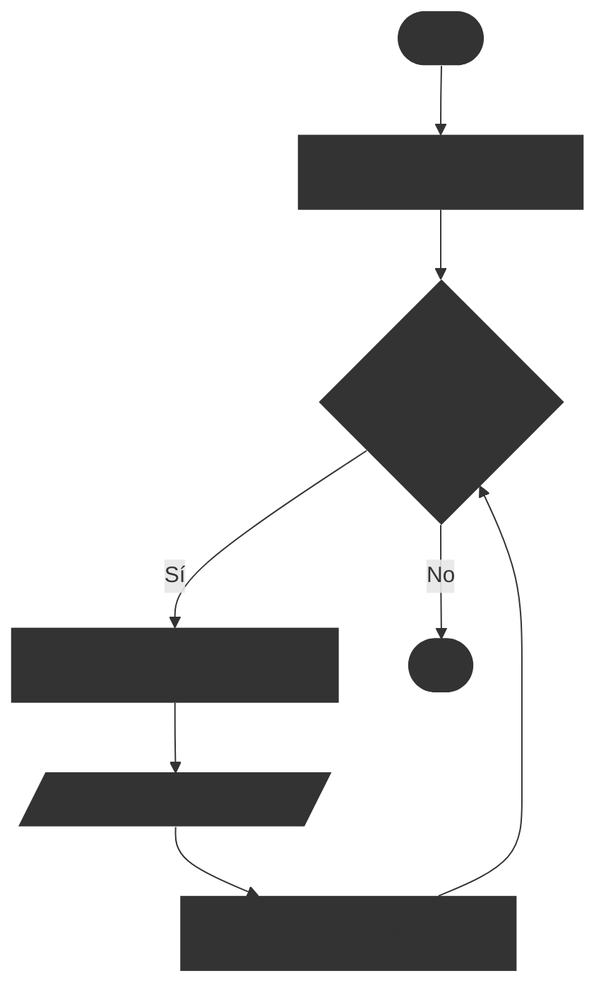
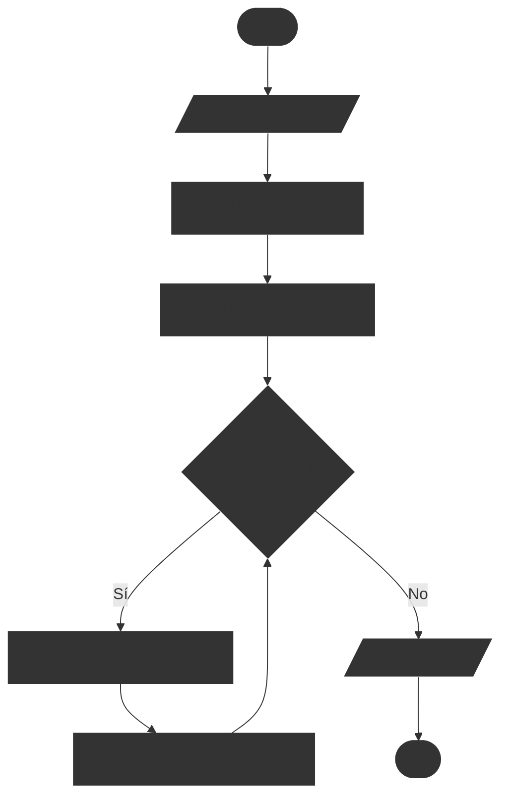
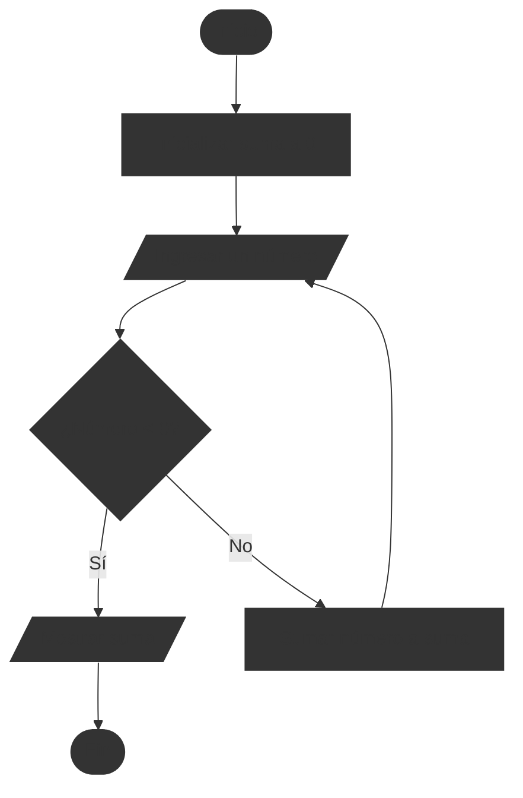

# Ejercicios de diagramas de flujo #1

En esta sección, encontrarás una serie de ejercicios diseñados para practicar y mejorar tus habilidades en la creación y comprensión de diagramas de flujo. Cada ejercicio presenta un problema específico que deberás resolver utilizando un diagrama de flujo adecuado.

Además, se proporcionan soluciones detalladas para cada ejercicio, permitiéndote comparar tu enfoque con el presentado y aprender de las diferentes maneras de representar procesos mediante diagramas de flujo.

## Ejercicio 1: Cálculo del área de un rectángulo

Crea un diagrama de flujo que calcule el área de un rectángulo. El diagrama debe solicitar al usuario que ingrese la longitud y el ancho del rectángulo, y luego calcular y mostrar el área.

::: details Problema resuelto

Este es un problema sencillo que implica la entrada de datos, un cálculo básico y la salida del resultado. Lo primero es pedir al usuario que ingrese la longitud y el ancho del rectángulo. Luego, se calcula el área multiplicando la longitud por el ancho. Finalmente, se muestra el resultado al usuario.

:::

## Ejercicio 2: Determinar cual es el número mayor de dos números

Crea un diagrama de flujo que compare dos números ingresados por el usuario y determine cuál es el mayor. El diagrama debe solicitar al usuario que ingrese los dos números, comparar los valores y mostrar cuál es el mayor.

::: details Problema resuelto

Para este ejercicio, el diagrama de flujo debe comenzar solicitando al usuario que ingrese dos números. Luego, se utiliza una decisión para comparar los dos números. Si el primer número es mayor que el segundo, se muestra un mensaje indicando que el primer número es mayor. De lo contrario, se muestra un mensaje indicando que el segundo número es mayor.

:::

## Ejercicio 3: El mayor de dos números con manejo de igualdad

En el diagrama de flujo anterior solo pide mostrar cuál es el número mayor, pero no maneja el caso en que ambos números son iguales. Modifica el diagrama de flujo para que también maneje este caso, mostrando un mensaje adecuado cuando los números sean iguales.

::: details Problema resuelto

Este problema sigue la misma lógica que el ejercicio anterior, pero añade una verificación adicional para el caso en que ambos números sean iguales. Después de comparar si el primer número es mayor que el segundo, se añade otra decisión para verificar si el primer número es menor que el segundo. Si ninguna de estas condiciones se cumple, significa que ambos números son iguales.

:::

## Ejercicio 4: Cálculo de $2^4$

Crea un diagrama de flujo que calcule el valor de $2^4$ utilizando un bucle. El diagrama debe inicializar una variable para el resultado, luego multiplicar por 2 en cada iteración del bucle hasta alcanzar la potencia deseada, y finalmente mostrar el resultado.

::: details Problema resuelto

Este ejercicio es muy lineal, ya que el valor de $2^4$ se puede calcular simplemente multiplicando 2 por si mismo cuatro veces.

:::

## Ejercicio 5: Cálculo de $2^4$ usando un bucle

Realiza un diagrama de flujo que calcule el valor de $2^4$ utilizando un bucle. El diagrama debe inicializar una variable para el resultado, luego utilizar un bucle para multiplicar por 2 en cada iteración hasta alcanzar la potencia deseada, y finalmente mostrar el resultado.

::: details Problema resuelto

:::

## Ejercicio 6: Cálculo de la suma de los primeros N números naturales

Crea un diagrama de flujo que calcule la suma de los primeros N números naturales. El diagrama debe solicitar al usuario que ingrese el valor de N, luego calcular la suma desde 1 hasta N y mostrar el resultado.

::: details Problema resuelto

:::

## Ejercicio 6: Verificar si un número es par o impar

Crea un diagrama de flujo que verifique si un número ingresado por el usuario es par o impar. El diagrama debe solicitar al usuario que ingrese un número, realizar la verificación y mostrar un mensaje indicando si el número es par o impar.

::: details Problema resuelto

Nótese que aquí usamos el operador módulo `%` para determinar si un número es par o impar. Este operador devuelve el resto de la división del número entre 2. Si el resto es 0, el número es par; de lo contrario, es impar.

:::

## Ejercicio 7: Factorial de un número

Crea un diagrama de flujo que calcule el factorial de un número ingresado por el usuario. El diagrama debe solicitar al usuario que ingrese un número, calcular su factorial y mostrar el resultado.

::: details Problema resuelto

:::

## Ejercicio 8: Valores de la función seno para ángulos de 0 a 360 grados

Crea un diagrama de flujo que calcule y muestre los valores de la función seno para ángulos desde 0 hasta 360 grados en incrementos de 10 grados.

::: details Problema resuelto

:::

## Ejercicio 9: Suma de números pares hasta un número dado

Crea un diagrama de flujo que calcule la suma de todos los números pares desde 1 hasta un número N ingresado por el usuario.

::: details Problema resuelto

:::

## Ejercicio 10: Suma de números hasta un número negativo

Crea un diagrama de flujo que sume números ingresados por el usuario hasta que se ingrese un número negativo. El diagrama debe solicitar al usuario que ingrese números, sumar los números positivos y mostrar la suma total cuando se ingrese un número negativo.

::: details Problema resuelto

:::