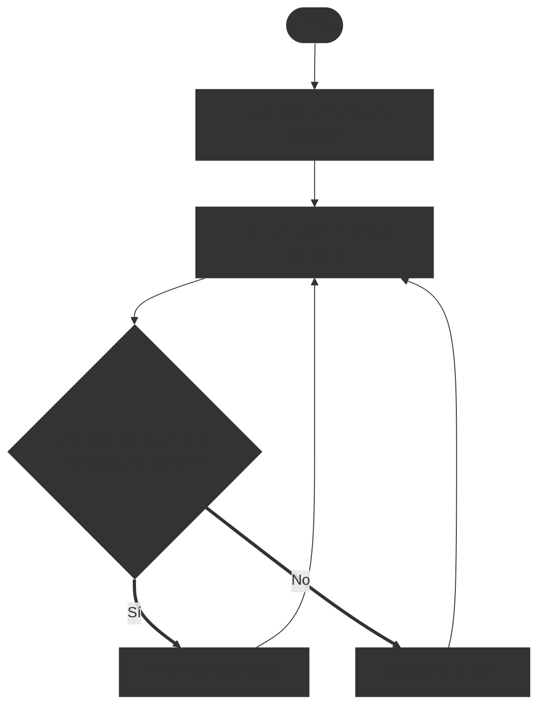
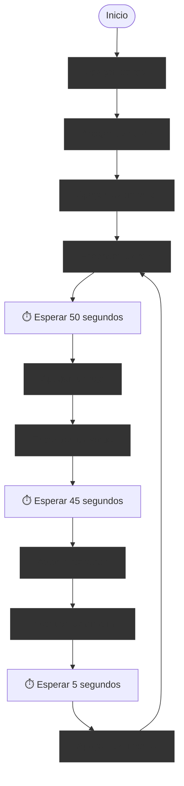
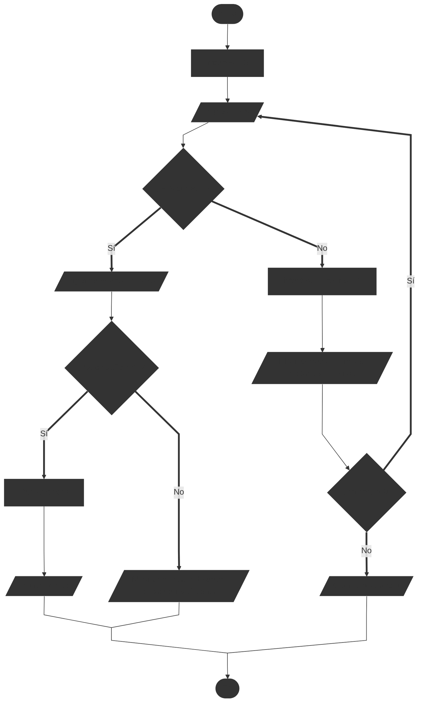

# Ejercicios de diagramas de flujo #2

En esta sección, encontrarás una serie de ejercicios diseñados para practicar y mejorar tus habilidades en la creación y comprensión de diagramas de flujo. Estos ejercicios representan situaciones de procesos prácticos y aplicaciones en el mundo real.

## Ejercicio 1: Calentador de agua inteligente

Realizar un diagrama de flujo para que un calentador de agua caliente el agua hasta una temperatura deseada. El calentador debe encenderse cuando la temperatura del agua esté por debajo de la temperatura objetivo y apagarse cuando se alcance o supere dicha temperatura.

::: details Problema resuelto

Este es un diagrama de flujo que tiene un bucle para verificar continuamente la temperatura del agua y controlar el calentador en consecuencia. No tiene fin, ya que el calentador debe seguir funcionando indefinidamente para mantener la temperatura del agua.

:::

## Ejercicio 2: Calentador de agua inteligente con verificación de nivel de agua

En el ejemplo anterior, no se tenía en cuenta el nivel del agua, lo que podría causar daños al calentador si se intenta calentar agua cuando no hay suficiente o también desperdiciar energía/combustible. Realizar un diagrama de flujo que incluya una verificación del nivel de agua antes de encender el calentador. Si el nivel de agua es bajo, el calentador no debe encenderse y debe mostrar una advertencia.

::: details Problema resuelto

Este diagrama de flujo incluye una verificación adicional del nivel de agua antes de decidir si encender o apagar el calentador. Si el nivel de agua es bajo, se muestra una advertencia y no se enciende el calentador.

:::

## Ejercicio 3: Semáforo de 3 colores

Realizar un diagrama de flujo para un semáforo que cambia entre tres colores: rojo, amarillo y verde. El semáforo debe permanecer en cada color durante un tiempo específico antes de cambiar al siguiente color en el ciclo: rojo -> verde -> amarillo -> rojo.

- Rojo: 50 segundos
- Verde: 45 segundos
- Amarillo: 5 segundos

::: details Problema resuelto

Este diagrama de flujo representa el ciclo continuo de un semáforo que cambia entre los colores rojo, verde y amarillo, permaneciendo en cada color durante el tiempo especificado. El diagrama no tiene fin, ya que el semáforo debe seguir funcionando indefinidamente. Se inicia apagando las luces (solo para darles un estado inicial) luego comienza el ciclo.

:::

## Ejercicio 4: Cajero con PIN y saldo suficiente

Realizar un diagrama de flujo para un cajero automático que permita a un usuario retirar dinero solo si ingresa el PIN correcto y tiene suficiente saldo en su cuenta. Si el PIN es incorrecto, solo puede tener tres intentos antes de bloquear la cuenta. Si el saldo es insuficiente, debe mostrar un mensaje de error.

::: details Problema resuelto

Este diagrama de flujo incluye verificaciones para el PIN y el saldo antes de permitir un retiro. Si el usuario ingresa un PIN incorrecto, tiene hasta tres intentos antes de que la cuenta se bloquee. Si el saldo es insuficiente, se muestra un mensaje de error.

:::
