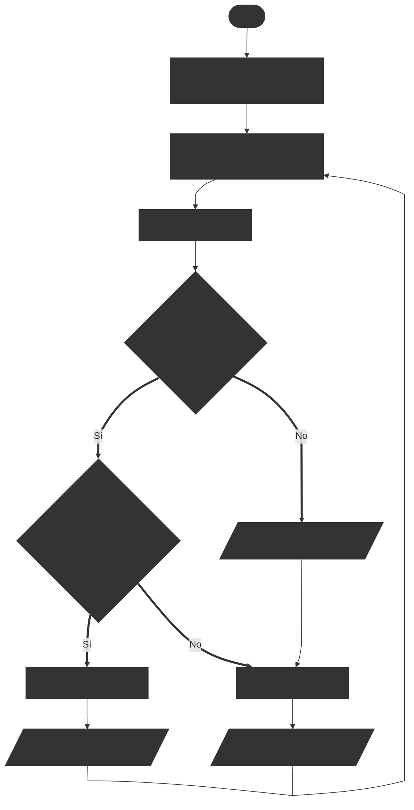

# Ejercicios de diagramas de flujo #2

En esta sección, encontrarás una serie de ejercicios diseñados para practicar y mejorar tus habilidades en la creación y comprensión de diagramas de flujo. Estos ejercicios representan situaciones de procesos prácticos y aplicaciones en el mundo real.

## Ejercicio 1: Calentador de agua inteligente

Realizar un diagrama de flujo para que un calentador de agua caliente el agua hasta una temperatura deseada. El calentador debe encenderse cuando la temperatura del agua esté por debajo de la temperatura objetivo y apagarse cuando se alcance o supere dicha temperatura.

::: details Problema resuelto

Este es un diagrama de flujo que tiene un bucle para verificar continuamente la temperatura del agua y controlar el calentador en consecuencia. No tiene fin, ya que el calentador debe seguir funcionando indefinidamente para mantener la temperatura del agua.

:::

## Ejercicio 2: Calentador de agua inteligente con verificación de nivel de agua

En el ejemplo anterior, no se tenía en cuenta el nivel del agua, lo que podría causar daños al calentador si se intenta calentar agua cuando no hay suficiente o también desperdiciar energía/combustible. Realizar un diagrama de flujo que incluya una verificación del nivel de agua antes de encender el calentador. Si el nivel de agua es bajo, el calentador no debe encenderse y debe mostrar una advertencia.

::: details Problema resuelto

Este diagrama de flujo incluye una verificación adicional del nivel de agua antes de decidir si encender o apagar el calentador. Si el nivel de agua es bajo, se muestra una advertencia y no se enciende el calentador.

:::