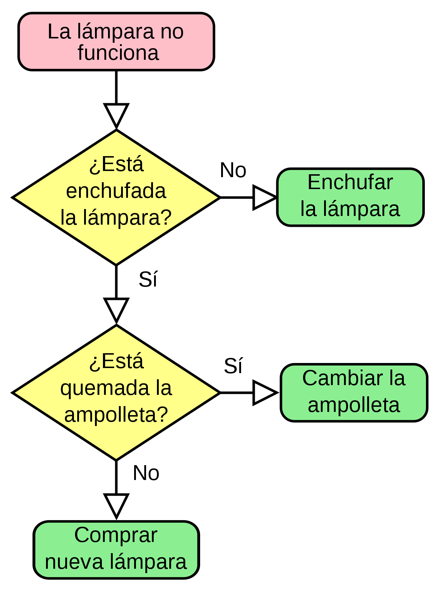
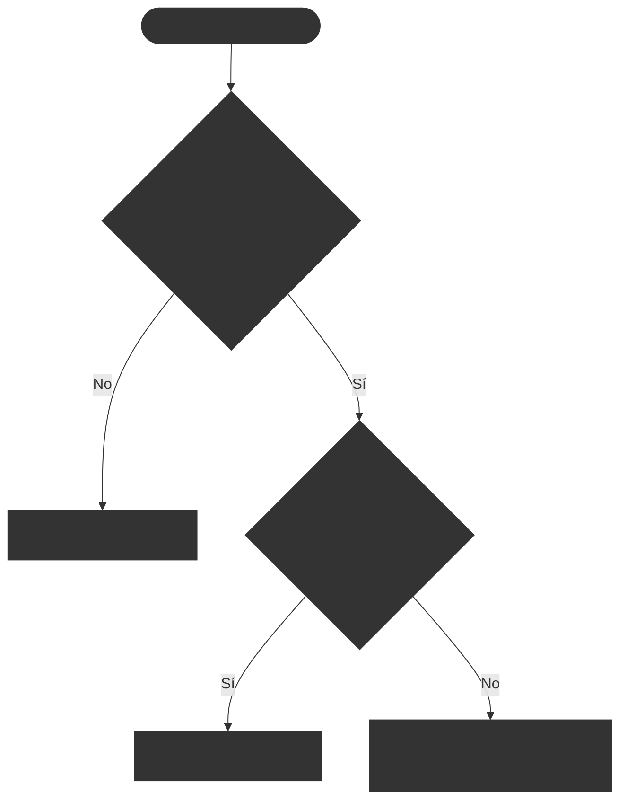

# Diagrama de flujo

Un diagrama de flujo es una representación gráfica que ilustra el flujo de un proceso o sistema mediante símbolos y flechas. Estos diagramas son herramientas visuales que ayudan a comprender, analizar y comunicar cómo funcionan los procesos, facilitando la identificación de pasos, decisiones y posibles mejoras.

<!--  -->

Este ejemplo de diagrama de flujo muestra el proceso para diagnosticar por qué una lámpara no funciona, incluyendo decisiones y acciones a tomar. No es un diagrama exhaustivo, pero ilustra cómo se pueden representar visualmente los pasos en un proceso. 

Los diagramas de flujo utilizan una variedad de símbolos estandarizados para representar diferentes tipos de acciones o decisiones.

| Símbolo | Nombre | Descripción |
|---------|--------|-------------|
|  | Terminador | Representa el inicio o el final de un proceso. |
|  | Proceso | Indica una acción o tarea que se debe realizar. |
|  | Decisión | Representa un punto donde se debe tomar una decisión, generalmente con respuestas "sí" o "no". |
|  | Entrada/Salida | Indica la entrada o salida de datos en el proceso. |
|  | Conector | Utilizado para conectar diferentes partes del diagrama, especialmente cuando se extiende a múltiples páginas. |

Estos símbolos se combinan para crear diagramas que representan procesos complejos de manera clara y concisa, facilitando la comprensión y el análisis de los mismos.
