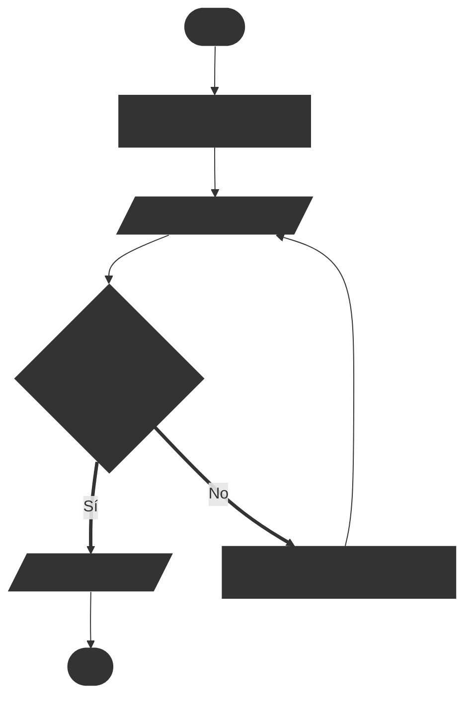
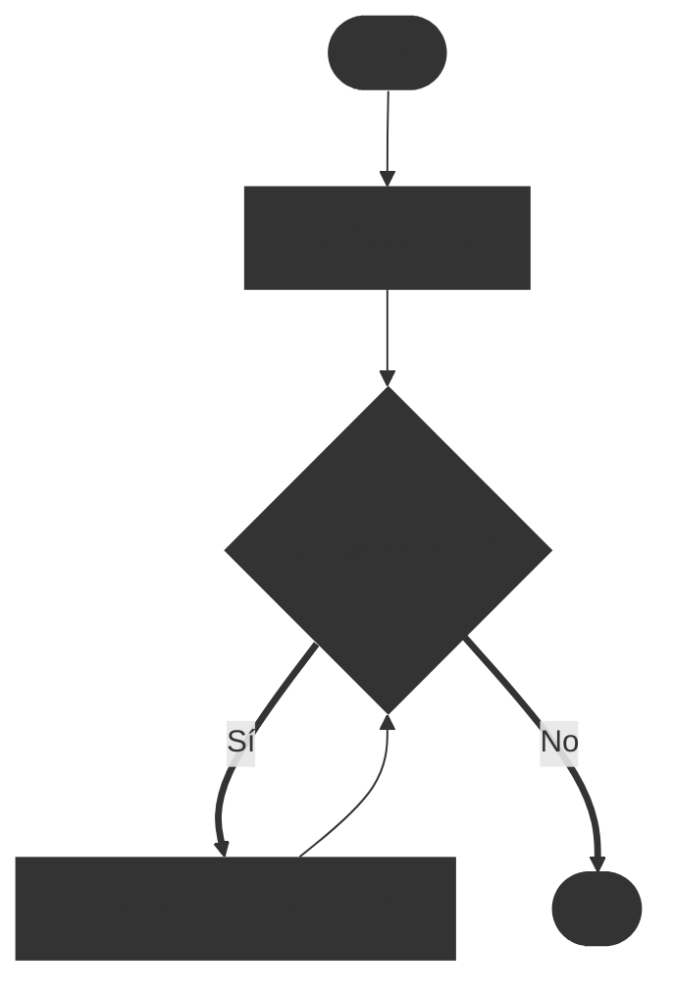
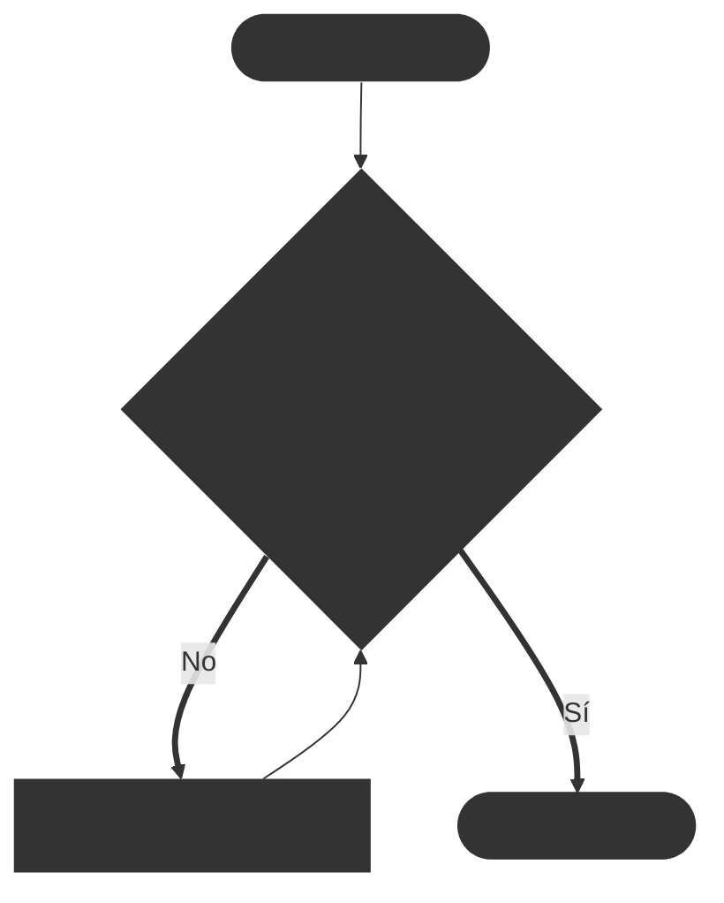

# Bucles y flujos repetitivos

En los diagramas de flujo, los bucles o flujos repetitivos se utilizan para representar procesos que se repiten hasta que se cumple una condición específica. Estos bucles son esenciales para modelar situaciones donde una serie de acciones deben ejecutarse múltiples veces.

Trabajar con bucles es muy confuso para muchos principiantes, ya que implica que el flujo del diagrama regrese a un punto anterior, creando una estructura cíclica. Es importante entender cómo funcionan los bucles para poder representarlos correctamente en un diagrama de flujo, así como saber en que punto debe retornar el flujo y bajo qué condiciones.

::: tip 🎯 Ejemplo de diagrama de flujo con bucle

Vamos a crear un diagrama de flujo que incluya un bucle. El problema que vamos a resolver es el siguiente:

> Introducir números hasta que se introduzca un número negativo, luego mostrar la suma de todos los números introducidos.

Primero, listamos los pasos necesarios para resolver el problema:

```
1. Inicio
2. Inicializar suma a 0
3. Introducir un número
4. Si el número es negativo, ir al paso 7
5. Añadir el número a la suma
6. Volver al paso 3
7. Mostrar la suma
8. Fin
```

Ahora, dibujamos el diagrama de flujo utilizando un bucle para repetir la introducción de números:


:::

Vemos que en el proceso listado anterior, marcamos que debemos saltar de un paso a otro dependiendo de una condición (si el número es negativo o no). En el diagrama de flujo, esto se representa con un símbolo de decisión (rombo) que tiene dos salidas: una para "Sí" y otra para "No". Si la condición es "No", el flujo regresa al paso de introducir un número, creando así un bucle que se repite hasta que se introduce un número negativo. Pero un paso puede indicar que tenemos que saltar a otro paso, esto es cuando los caminos se vuelven a unir después de una bifurcación.

## Bucles infinitos

Los bucles suelen tener una condición de salida para evitar que se repitan indefinidamente. Sin embargo, es posible crear bucles infinitos si la condición de salida nunca se cumple. En los diagramas de flujo, esto se representa con un bucle que no tiene una ruta de salida clara.

::: warning ⚠️ Advertencia sobre bucles infinitos
Es importante tener cuidado al diseñar bucles en diagramas de flujo para evitar bucles infinitos, ya que pueden llevar a procesos que nunca terminan. Asegúrate siempre de definir una condición clara para salir del bucle.
:::

::: tip 🎯 Ejemplo de diagrama de flujo con bucle infinito


:::

En este ejemplo, el bucle continúa incrementando el contador indefinidamente porque la condición `contador >= 0` siempre es verdadera para números enteros. Por lo tanto, el flujo nunca llega al paso de "Fin".

Si deseas evitar bucles infinitos, asegúrate de que la condición de salida pueda ser alcanzada en algún momento durante la ejecución del bucle.

## Cuando usar bucles infinitos

Aunque los bucles infinitos suelen ser indeseables, hay situaciones en las que son útiles, como en servidores o programas que deben ejecutarse continuamente hasta que se les indique lo contrario. En estos casos, es crucial implementar mecanismos para salir del bucle de manera controlada, como señales de interrupción o condiciones externas.

::: tip 🎯 Ejemplo de diagrama de flujo con bucle infinito controlado

> Un servidor que escucha solicitudes hasta que se recibe una señal de apagado.


:::

En este ejemplo, el servidor continúa escuchando solicitudes en un bucle hasta que se recibe una señal de apagado, momento en el cual el flujo sale del bucle y procede a apagar el servidor de manera controlada.

Otro caso útil son en el uso de microcontroladores o sistemas embebidos que deben ejecutar tareas repetitivas continuamente, como leer sensores o controlar actuadores, hasta que se apague el sistema o se reinicie de manera externa o manual.

