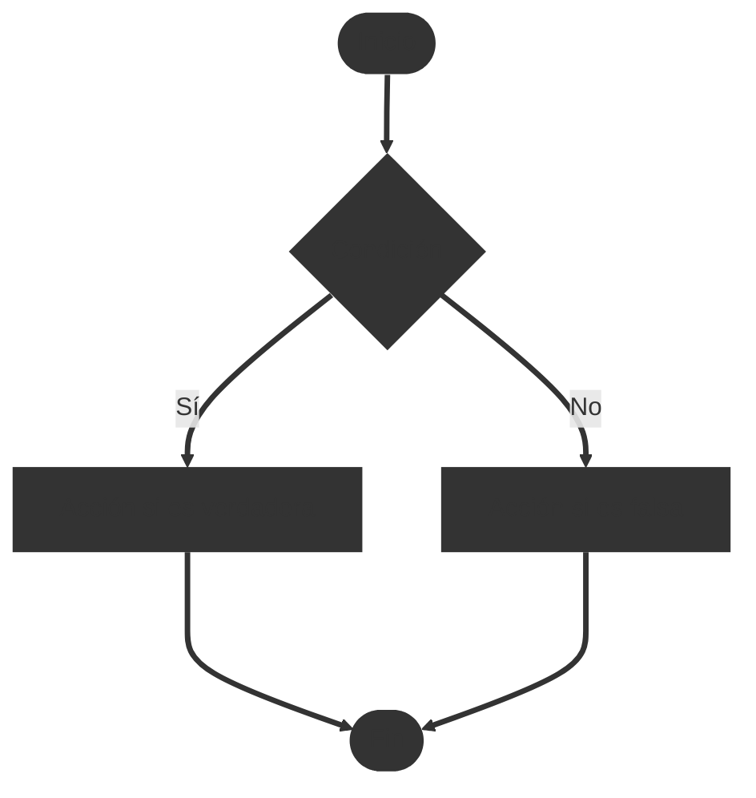
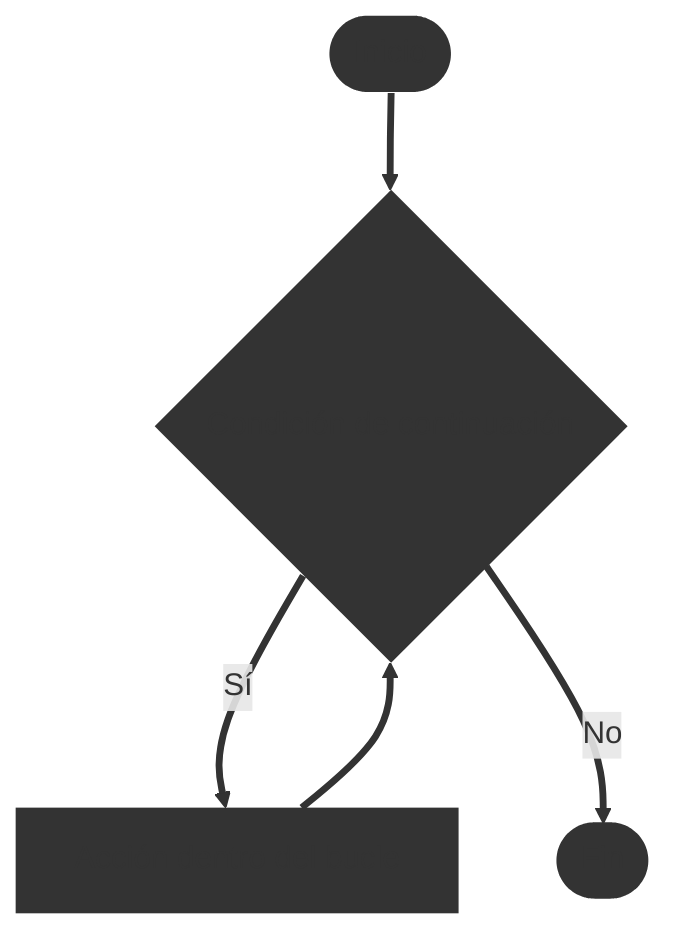
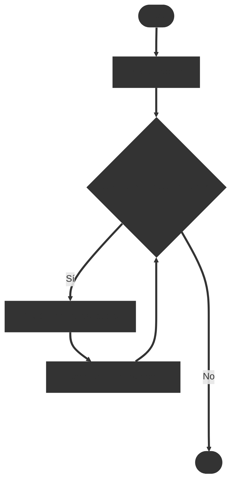
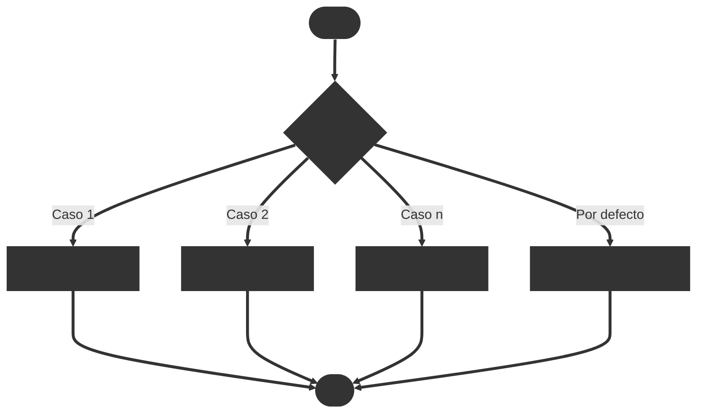

# Sentencias en diagramas de flujo

## Sentencia `if`

<!-- #region if-statement -->

<!-- #endregion if-statement -->

## Sentencia `while`

<!-- #region while-statement -->

<!-- #endregion while-statement -->

## Sentencia `for`

<!-- #region for-statement -->

<!-- #endregion for-statement -->

## Sentencia `switch`

<!-- #region switch-statement -->

<!-- #endregion switch-statement -->

