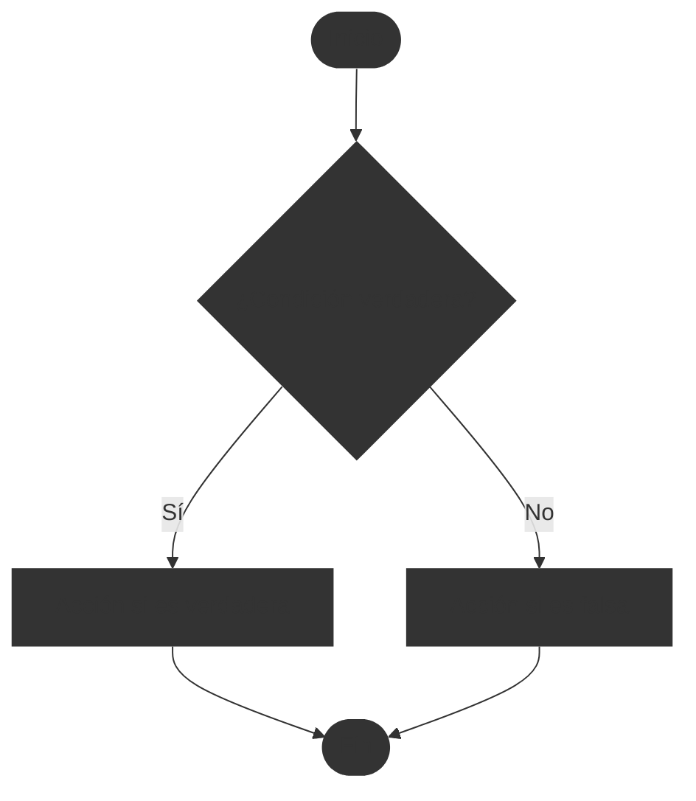

# Sentencias en diagramas de flujo

## Sentencia `if`

```mermaid
flowchart TD
  A([Inicio])
  B{¿Condición verdadera?}
  C[Acción si es verdadera]
  D[Acción si es falsa]
  E([Fin])

  A --> B
  B -- Sí --> C
  B -- No --> D
  C --> E
  D --> E

  classDef start-end fill: inherit,stroke:inherit,stroke-width:inherit;
  classDef process fill: inherit,stroke:inherit,stroke-width:inherit;
  classDef decision fill:inherit,stroke:inherit,stroke-width:inherit;

  class B decision
  class C,D process
  class A,E start-end
```