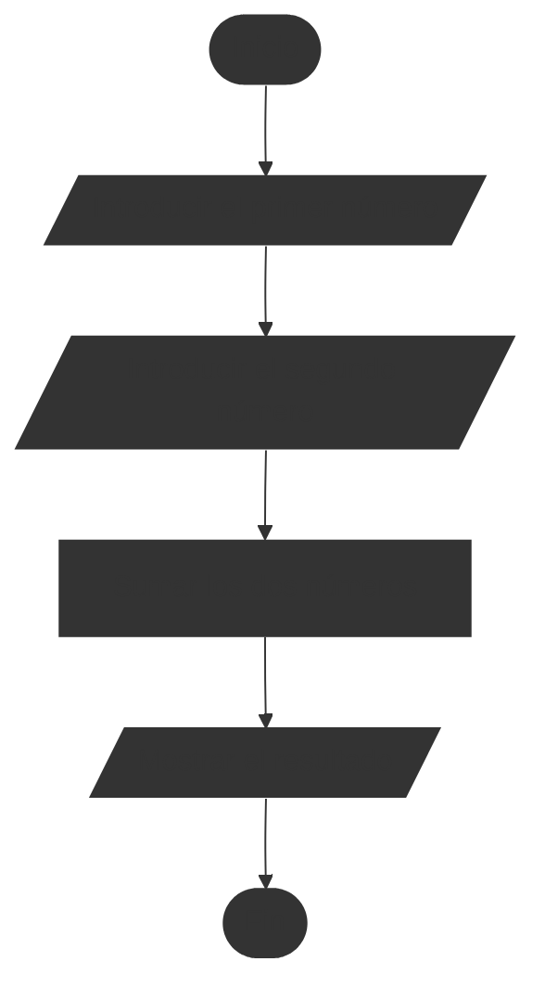
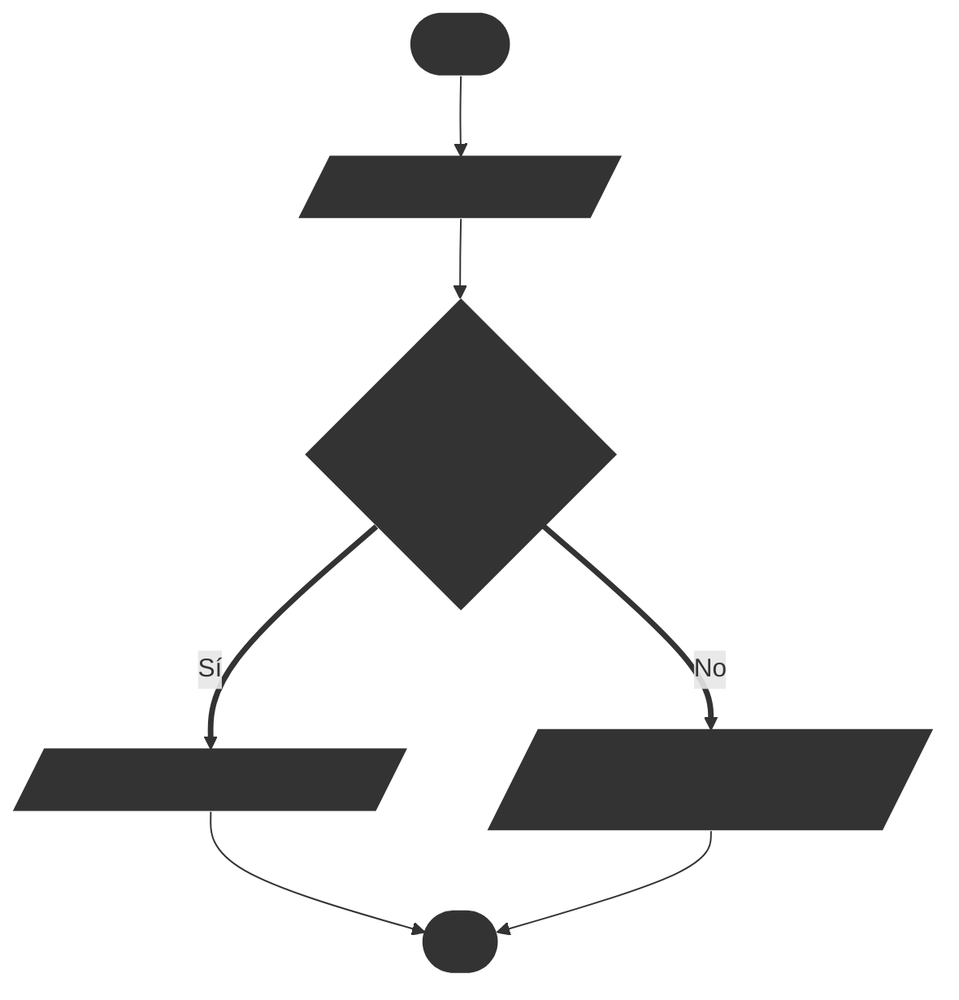

# Trabajar con diagramas de flujo

## Crear un diagrama de flujo

Para crear un diagrama de flujo solo necesitamos lápiz y papel. También podemos utilizar herramientas digitales como software de diagramación (por ejemplo, Microsoft Visio (De pago, sin versión gratuita), Lucidchart, Draw.io) o lenguajes de marcado como Mermaid para generar diagramas de flujo de manera programática.

::: tip 🎯 Ejemplo de diagrama de flujo simple
Vamos a crear un diagrama de flujo sencillo, el problema que vamos a resolver es el siguiente:

> Introduzca dos números y muestre su suma.

Algo fácil, ¿verdad? Vamos a ver cómo representarlo, pero antes, primero con una técnica que nos ayuda un poco a organizar nuestras ideas, listar los pasos que necesitamos para resolver el problema:

```
1. Inicio
2. Introducir el primer número
3. Introducir el segundo número
4. Sumar los dos números
5. Mostrar el resultado
6. Fin
```

Ahora que tenemos los pasos, podemos empezar a dibujar el diagrama de flujo. Empezamos con el símbolo de inicio, luego añadimos los pasos uno por uno utilizando los símbolos adecuados para cada acción. Finalmente, conectamos todos los símbolos con flechas para mostrar el flujo del proceso.

El resultado final debería verse algo así:


:::

Sin embargo este diagrama de flujo es muy simple, es muy lineal, no tiene decisiones ni bucles. En la siguiente sección veremos cómo representar decisiones y bucles en diagramas de flujo.

## Trabajar con decisiones

Las decisiones en diagramas de flujo se representan con un símbolo de rombo. Este símbolo tiene dos o más salidas, cada una representando una posible decisión o camino a seguir basado en una condición. Suele ser complicado de entender al principio, porque con este símbolo el diagrama se bifurca en varios caminos y luego se vuelven a unir.

::: tip 🎯 Ejemplo de diagrama de flujo con decisiones

Vamos a crear un diagrama de flujo que incluya una decisión. El problema que vamos a resolver es el siguiente:

> Introduzca un número y determine si es par o impar.

Primero, listamos los pasos necesarios para resolver el problema:

```
1. Inicio
2. Introducir un número
3. Verificar si el número es par
4. Si es par, mostrar "El número es par"
5. Si es impar, mostrar "El número es impar"
6. Fin
```
Ahora, dibujamos el diagrama de flujo utilizando el símbolo de rombo para la decisión:


:::

Nótese como el símbolo de rombo en el diagrama representa la decisión de si el número es par o impar, y cómo el flujo se bifurca en dos caminos diferentes basados en esa decisión. A pesar de que en la lista de pasos parecía muy lineal, al representarlo en un diagrama de flujo con decisiones, se vuelve más claro cómo se manejan las diferentes condiciones.

