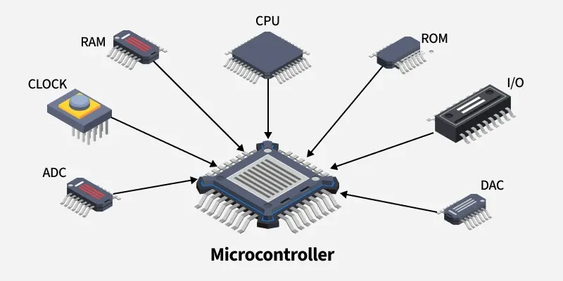
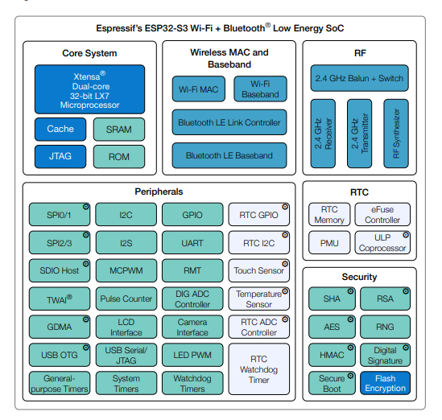

# Arquitectura de microcontroladores

Los microcontroladores son dispositivos compactos que integran varios componentes esenciales en un solo chip para realizar tareas específicas en sistemas embebidos. La arquitectura típica de un microcontrolador incluye los siguientes componentes principales:

1. **Unidad Central de Procesamiento (CPU)**: Es el "cerebro" del microcontrolador, responsable de ejecutar instrucciones y procesar datos. La CPU interpreta y ejecuta el código almacenado en la memoria.
2. **Memoria**:
   - **Memoria de Programa (Flash/ROM)**: Almacena el código del programa que se ejecuta en el microcontrolador. Es no volátil, lo que significa que retiene la información incluso cuando el dispositivo está apagado.
   - **Memoria de Datos (RAM)**: Utilizada para almacenar datos temporales y variables durante la ejecución del programa. Es volátil, por lo que pierde su contenido cuando se apaga el microcontrolador.
   - **Memoria EEPROM**: Una memoria no volátil que permite almacenar datos que deben conservarse entre reinicios, como configuraciones o calibraciones.
3. **Periféricos internos**: Estos son módulos adicionales integrados en el microcontrolador para realizar funciones específicas. Algunos periféricos comunes incluyen:
   - **Entrada/Salida (I/O)**: Estos pines permiten la comunicación del microcontrolador con el mundo exterior. Pueden configurarse como entradas o salidas para interactuar con sensores, actuadores y otros dispositivos.
   - **Convertidores Analógico-Digitales (ADC)**: Permiten al microcontrolador leer señales analógicas (como voltajes de sensores) y convertirlas en valores digitales que la CPU puede procesar.
   - **Convertidores Digital-Analógicos (DAC)**: Permiten al microcontrolador generar señales analógicas a partir de valores digitales, útiles para controlar dispositivos analógicos.
   - **Interfaces de Comunicación**: Incluyen protocolos como UART, SPI, I2C, CAN, entre otros, que permiten la comunicación con otros dispositivos y microcontroladores.
4. **Temporizadores/Contadores**: Utilizados para medir intervalos de tiempo, generar retardos o contar eventos externos. Son esenciales para tareas de temporización y control.
8. **Reloj del Sistema**: Proporciona la señal de temporización necesaria para sincronizar las operaciones del microcontrolador. Puede ser un oscilador interno o un cristal externo.

::: info 💡 Dato curioso
Antes los microcontrollers no solían tener FPU (Floating Point Unit) integrada, muy pocos lo incluían, lo que limitaba su capacidad para realizar cálculos en punto flotante (números decimales) de manera eficiente. Hoy es común encontrarla en arquitecturas modernas como ARM Cortex-M4/M7 o varios modelos RISC-V, lo que acelera mucho cálculos matemáticos..
:::

## Arquitecturas comunes de microcontroladores

La arquitectura de un microcontrolador no solamente se basa en los componentes que lo conforman, sino también en el diseño y conjunto de instrucciones que utiliza su CPU. A continuación, se describen algunas de las arquitecturas más comunes en microcontroladores:

- ARM Cortex-M (Arquitectura RISC)
- Xtensa (Ejemplo: Espressif ESP32 clásicos)
- RISC-V (Ejemplo: ESP32-C3, ESP32-C6)
- AVR (Atmel/Microchip – Ejemplo:  Arduino UNO)
- PIC (Microchip)
- MSP430 (Texas Instruments)

::: info 📚 Info
Cada una de estas arquitecturas tiene sus propias características, ventajas y desventajas, lo que las hace adecuadas para diferentes aplicaciones y requisitos de diseño. La elección de la arquitectura adecuada depende de factores como el rendimiento, el consumo de energía, el costo y la disponibilidad de herramientas de desarrollo. 

Por ejemplo, si se quiere usar Rust en microcontroladores, las arquitecturas más soportadas son ARM Cortex-M y RISC-V, pero no pueden usarse por ejemplo en AVR o PIC.
:::

## Ejemplo de diagrama de bloques de un microcontrolador

Aquí una imagen de bloques de un ESP32-S3 con todas sus partes principales:

