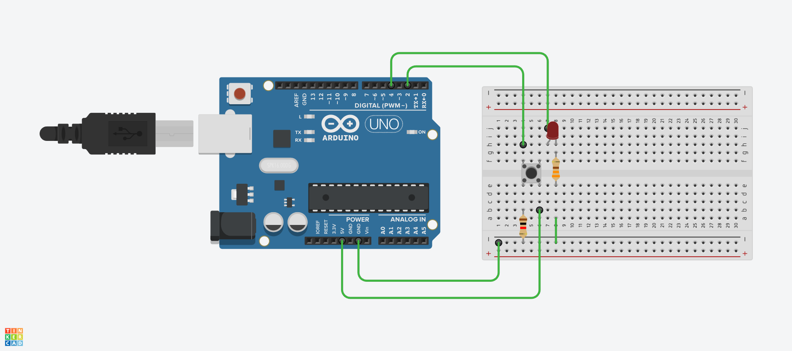

# Fundamentos de GPIO en microcontroladores

Ya vimos como hacer un "blink" con un microcontrolador, pero ¿cómo es que el microcontrolador puede interactuar con el mundo exterior? La respuesta está en los pines GPIO (General Purpose Input/Output).

## ¿Qué es GPIO?

`GPIO` son las siglas de "General Purpose Input/Output" (Entrada/Salida de Propósito General). Los pines GPIO son pines en un microcontrolador que pueden configurarse como entradas o salidas digitales. Esto permite que el microcontrolador pueda leer señales del exterior (como botones o sensores) o enviar señales para controlar dispositivos (como LEDs, motores, etc.).

## Configuración de pines GPIO

Para utilizar un pin GPIO, primero debes configurarlo como entrada o salida. Esto se hace mediante funciones específicas en el entorno de desarrollo que estés utilizando. Por ejemplo, en Arduino, se utiliza la función `pinMode()` para configurar un pin.

:::: tabs key:a

=== Arduino

```cpp [main.ino]
pinMode(pin, mode);
```

Donde `pin` es el número del pin que deseas configurar y `mode` puede ser `INPUT`, `OUTPUT` o `INPUT_PULLUP`.

=== ESP-IDF

```c [main.c]
gpio_set_direction(gpio_num_t pin, gpio_mode_t mode);
```

Donde `pin` es el número del pin y `mode` puede ser `GPIO_MODE_INPUT`, `GPIO_MODE_OUTPUT`, entre otros.

::::

### `OUTPUT`, `INPUT` y `INPUT_PULLUP`

- `OUTPUT`: Configura el pin para enviar señales (por ejemplo, encender un LED).
- `INPUT`: Configura el pin para recibir señales (por ejemplo, leer el estado de un botón).
- `INPUT_PULLUP`: Configura el pin como entrada con una resistencia pull-up interna, útil para evitar estados flotantes en botones. Dicho de forma más llana, cuando el botón no está presionado, el pin leerá un valor alto (HIGH) gracias a la resistencia pull-up interna. Cuando el botón se presiona, el pin se conecta a tierra (LOW).

::: info ℹ️ Nota
Un estado flotante ocurre cuando un pin de entrada no está conectado a una fuente de voltaje definida (ni HIGH ni LOW). Esto puede causar lecturas erráticas o impredecibles, esto ocurre especialmente cuando hay interferencias eléctricas o ruido eléctrico en el entorno. Usar `INPUT_PULLUP` ayuda a mantener el pin en un estado definido cuando no está siendo activamente conducido a LOW.

No todos los microcontroladores tienen resistencias pull-up internas, por lo que es importante verificar la documentación del microcontrolador que estás utilizando.
:::

## Leer y escribir en pines GPIO

Una vez que un pin GPIO está configurado, puedes leer su estado (si es una entrada) o escribir un valor (si es una salida).

:::: tabs key:a

=== Arduino

```cpp [main.ino]
digitalWrite(pin, value); // Para salidas
int state = digitalRead(pin); // Para entradas
```

Donde `value` puede ser `HIGH` o `LOW`.
=== ESP-IDF

```c [main.c]
gpio_set_level(gpio_num_t pin, uint32_t level); // Para salidas
int level = gpio_get_level(gpio_num_t pin); // Para entradas
``` 
Donde `level` puede ser `1` (HIGH) o `0` (LOW).
::::

::: danger ⚠️ Precaución
Siempre ten cuidado al conectar dispositivos a los pines GPIO. Consulta la hoja de datos de tu microcontrolador para conocer las limitaciones de voltaje y corriente. Conectar dispositivos que excedan estas limitaciones puede dañar permanentemente el microcontrolador.
:::

## Consideraciones sobre los pines GPIO

Los pines GPIO tienen limitaciones en cuanto a la corriente que pueden manejar. Es importante no exceder estas limitaciones para evitar dañar el microcontrolador. Consulta la hoja de datos de tu microcontrolador para conocer los valores máximos de corriente y voltaje.

Generalmente manejan voltajes de `3.3V` o `5V`, dependiendo del microcontrolador. Asegúrate de no conectar dispositivos que requieran voltajes más altos directamente a los pines GPIO. Además suelen suministrar una corriente limitada, entre `20mA` y `40mA` por pin. Si necesitas controlar dispositivos que requieren más corriente, como motores o luces brillantes, utiliza transistores o relés como intermediarios.

Otra cosa a tener en cuenta es el ruido eléctrico. Los pines GPIO pueden ser sensibles al ruido, lo que puede causar lecturas erráticas. Utiliza resistencias pull-up o pull-down y capacitores de desacoplamiento para minimizar estos efectos. Por ejemplo, al presionar un botón, es común que el pin GPIO lea múltiples cambios de estado debido al rebote del contacto, a esto se le conoce como `switch bouncing`. Para mitigar esto, se pueden implementar técnicas de "debouncing" en el software o hardware.

Y finalmente, ten en cuenta la configuración de los pines al iniciar el microcontrolador. Algunos pines pueden tener funciones especiales o estar configurados por defecto para ciertos usos, así que asegúrate de revisar la documentación para evitar conflictos.

## PinOuts 

Cada microcontrolador tiene un diseño diferente de pines GPIO. Es importante consultar el diagrama de pinout específico del microcontrolador que estás utilizando para identificar qué pines son GPIO y cuáles tienen funciones especiales. Por ejemplo, aquí hay algunos diagramas de pinout comunes:

:::: tabs key:a

=== Arduino Uno REV3


=== ESP32 DevKitC


::::

## Ejemplo práctico

Aquí tienes un ejemplo sencillo que utiliza un botón para controlar un LED. Cuando el botón se presiona, el LED se enciende; cuando se suelta, el LED se apaga.

```cpp
#include <Arduino.h>
const int buttonPin = 2;    // Pin del botón
const int ledPin = 4;      // Pin del LED

void setup() {
  pinMode(ledPin, OUTPUT);      // Configurar el pin del LED como salida
  pinMode(buttonPin, INPUT); // Configurar el pin del botón como entrada
}

void loop() {
  int buttonState = digitalRead(buttonPin); // Leer el estado del botón

  if (buttonState == HIGH) { // Si el botón está presionado
    digitalWrite(ledPin, HIGH); // Encender el LED
  } else {
    digitalWrite(ledPin, LOW); // Apagar el LED
  }
}
```

En este ejemplo, el pin 2 está configurado como entrada para el botón y el pin 4 como salida para el LED. El programa lee continuamente el estado del botón y enciende o apaga el LED en consecuencia.


