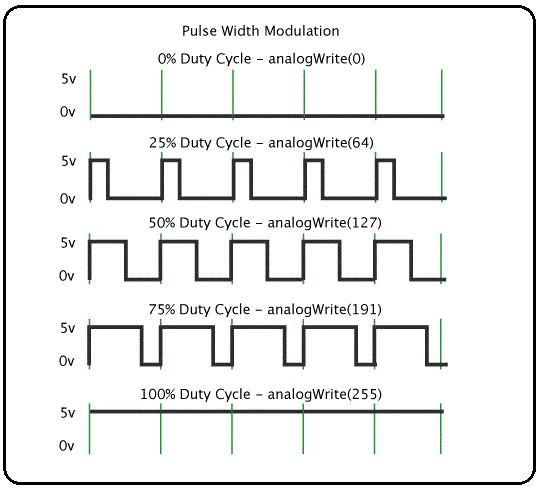

# PWM en microcontroladores

PWM (Modulación por Ancho de Pulso) es una técnica utilizada en microcontroladores para simular una señal analógica mediante la variación del ancho de los pulsos en una señal digital. Esta técnica es especialmente útil para controlar dispositivos como motores, LEDs y otros actuadores que requieren diferentes niveles de potencia o brillo.

## Señal PWM

Una señal PWM consiste en una serie de pulsos digitales que alternan entre un estado alto (HIGH) y un estado bajo (LOW). La proporción de tiempo que la señal está en estado alto se conoce como ciclo de trabajo (duty cycle) y se expresa como un porcentaje del período total de la señal. Por ejemplo, un ciclo de trabajo del 50% significa que la señal está en estado alto la mitad del tiempo y en estado bajo la otra mitad.

