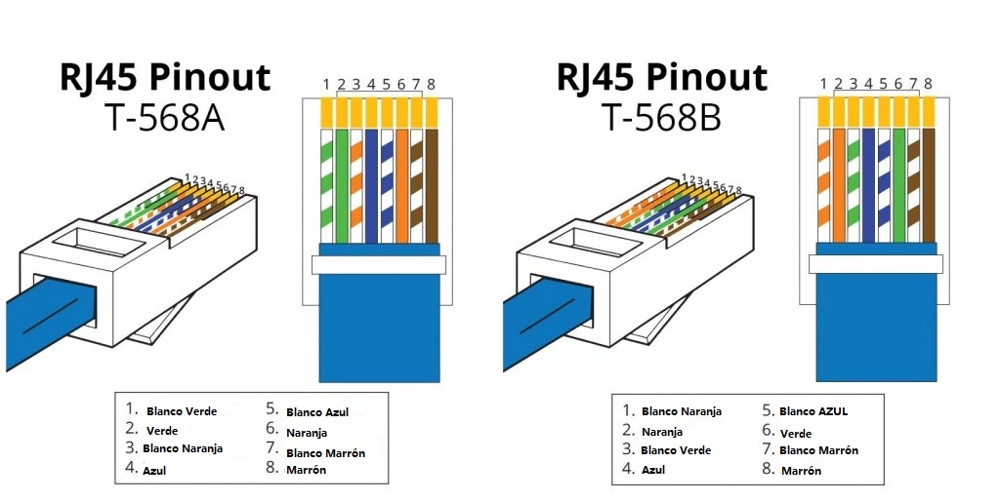

# Ethernet y cable UTP

Ethernet es una tecnología de red de área local (LAN) ampliamente utilizada que permite la comunicación entre dispositivos a través de un cableado físico. Fue desarrollada en la década de los 70s por Xerox PARC y posteriormente estandarizada por el Instituto de Ingenieros Eléctricos y Electrónicos (IEEE) bajo la norma IEEE 802.3. Ethernet ha evolucionado a lo largo de los años, ofreciendo velocidades de transmisión que van desde 10 Mbps hasta varios Gbps.

## Cable UTP

El cable UTP (Unshielded Twisted Pair) es un tipo de cable de red que consta de pares de hilos de cobre trenzados entre sí. Este diseño ayuda a reducir la interferencia electromagnética y mejora la calidad de la señal transmitida. El cable UTP es comúnmente utilizado en redes Ethernet debido a su costo relativamente bajo, facilidad de instalación y buen rendimiento.

## Estandares de Ethernet: T568A y T568B

Existen dos estándares principales para el cableado de cables UTP en redes Ethernet: T568A y T568B. Ambos estándares definen la disposición de los colores de los cables dentro del conector RJ45, que es el conector más comúnmente utilizado para conexiones Ethernet.

| Pin | T568A          | T568B          |
| --- | -------------- | -------------- |
| 1   | Blanco/Verde   | Blanco/Naranja |
| 2   | Verde          | Naranja        |
| 3   | Blanco/Naranja | Blanco/Verde   |
| 4   | Azul           | Azul           |
| 5   | Blanco/Azul    | Blanco/Azul    |
| 6   | Naranja        | Verde          |
| 7   | Blanco/Marrón  | Blanco/Marrón  |
| 8   | Marrón         | Marrón         |

### Diferencias entre T568A y T568B

- **T568A**: Es el estándar preferido por instituciones gubernamentales y es comúnmente utilizado en instalaciones residenciales. Ofrece compatibilidad con sistemas telefónicos antiguos.
- **T568B**: Es el estándar más comúnmente utilizado en instalaciones comerciales y es compatible con la mayoría de los equipos de red. Fue adoptado por la mayoría de los fabricantes de equipos de red.

### ¿Cuál estándar elegir?

La elección entre T568A y T568B depende del entorno y las necesidades específicas de la red. Es importante mantener la consistencia en toda la instalación para evitar problemas de conectividad. Si se está trabajando en una red existente, es recomendable seguir el estándar ya implementado.

El cableado cruzado (crossover) se utiliza para conectar directamente dos dispositivos del mismo tipo, como dos computadoras o dos switches. En este caso, un extremo del cable debe seguir el estándar T568A y el otro extremo debe seguir el estándar T568B. Actualmente, con la mayoría de los dispositivos modernos que soportan Auto-MDI/MDIX, el uso de cables cruzados es menos común, pero aún puede ser necesario en ciertos casos.

## PoE (Power over Ethernet)

Power over Ethernet (PoE) es una tecnología que permite la transmisión de energía eléctrica junto con datos a través de un cable Ethernet. Esto es especialmente útil para dispositivos como cámaras IP, teléfonos VoIP y puntos de acceso inalámbricos, ya que elimina la necesidad de una fuente de alimentación separada. PoE utiliza los pares de cables no utilizados en un cable UTP para suministrar energía, lo que simplifica la instalación y reduce el desorden de cables.
