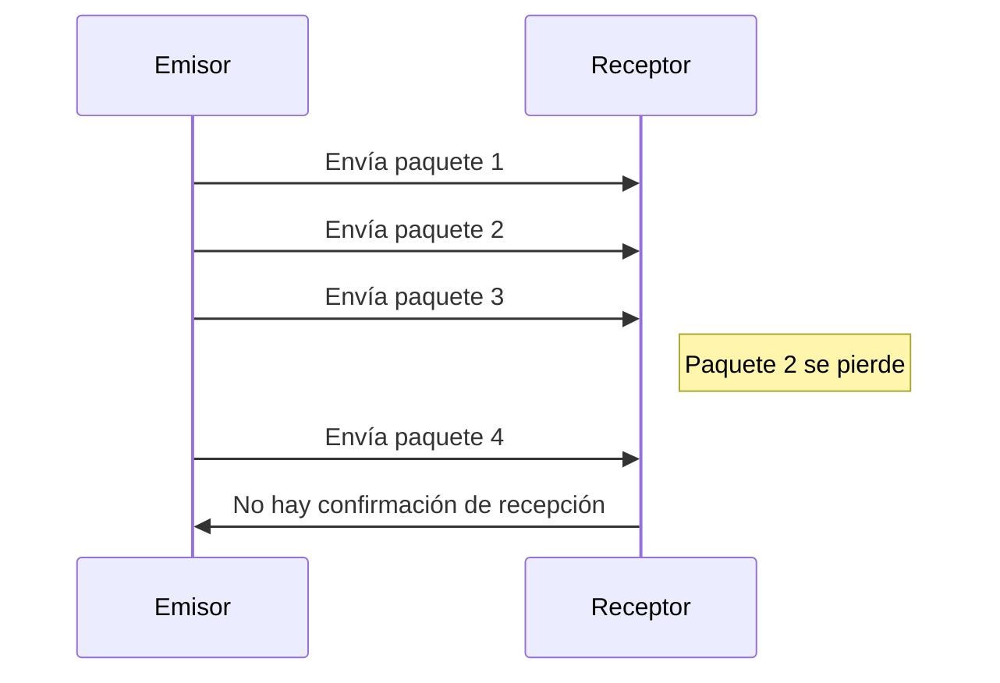
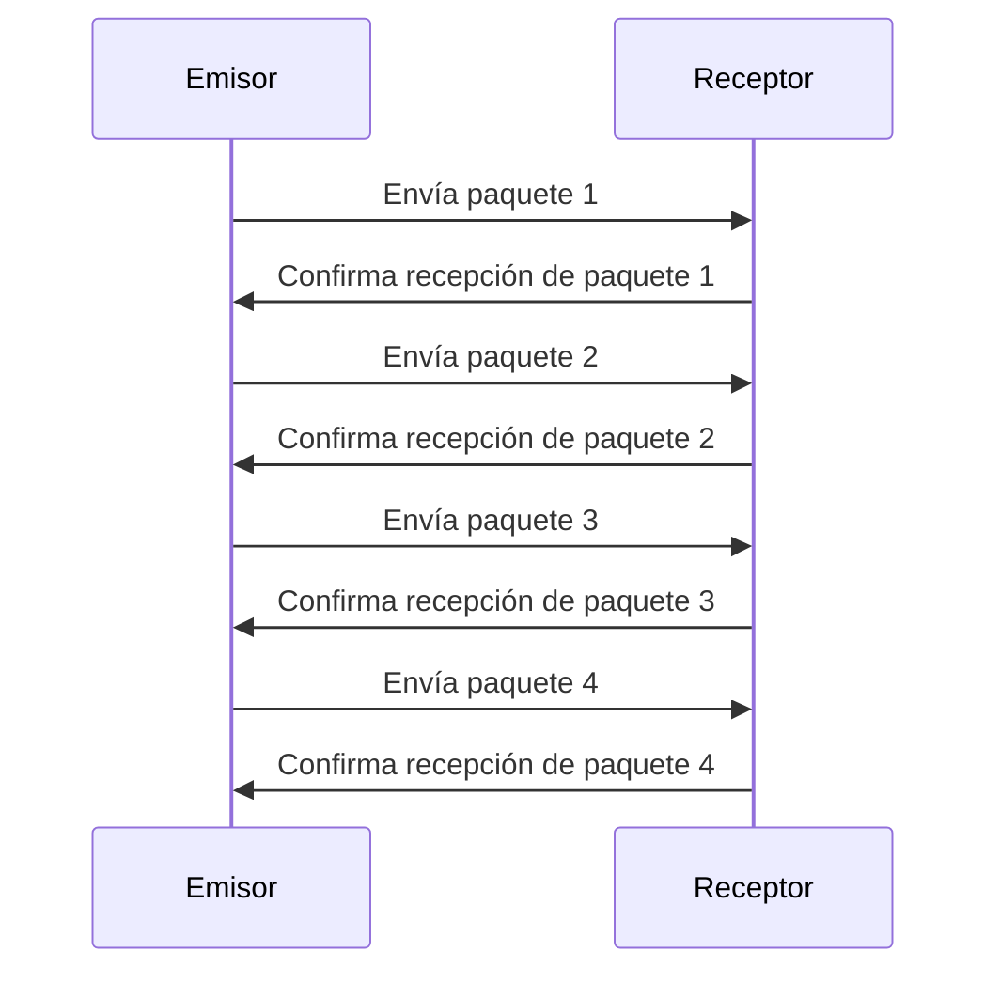
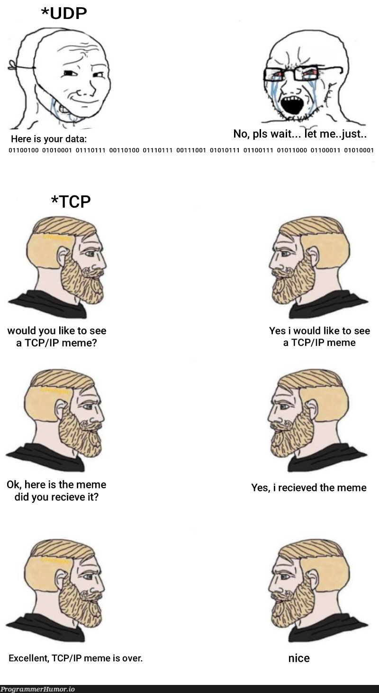

# Protocolos de Red

Los protocolos de red son conjuntos de reglas y estándares que permiten la comunicación entre dispositivos en una red. Estos protocolos definen cómo se transmiten los datos, cómo se establecen las conexiones y cómo se gestionan los errores.

## Protocolos Comunes

### Protocolo de Control de Transmisión/Protocolo de Internet (TCP/IP)

TCP/IP es el conjunto de protocolos más utilizado en redes, incluyendo Internet. TCP se encarga de la transmisión fiable de datos, mientras que IP se encarga del direccionamiento y enrutamiento de los paquetes de datos.

### Protocolo de Datagramas de Usuario (UDP)

UDP es un protocolo de comunicación que permite la transmisión de datos sin establecer una conexión previa. Es más rápido que TCP, pero no garantiza la entrega de los datos, lo que lo hace adecuado para aplicaciones en tiempo real como el streaming de video o juegos en línea.

### Protocolo de Transferencia de Hipertexto (HTTP/HTTPS)

HTTP es el protocolo utilizado para la transferencia de páginas web. HTTPS es la versión segura de HTTP, que utiliza cifrado para proteger la información transmitida entre el navegador y el servidor web.

En otra sección se explicará más sobre `HTTPS`.

### Protocolo de Transferencia de Archivos (FTP/SFTP)

FTP es un protocolo utilizado para la transferencia de archivos entre computadoras en una red. SFTP es la versión segura de FTP, que utiliza cifrado para proteger los datos durante la transferencia.

## Diferencias entre TCP y UDP

| Característica          | TCP                             | UDP                             |
|------------------------|---------------------------------|---------------------------------|
| Conexión               | Orientado a la conexión         | No orientado a la conexión      |
| Fiabilidad             | Garantiza la entrega de datos   | No garantiza la entrega de datos|
| Velocidad              | Más lento debido a la verificación | Más rápido, sin verificación    |
| Uso típico             | Transferencia de archivos, correo electrónico | Streaming de video, juegos en línea |

Un ejemplo visual de UDP

Un ejemplo visual de TCP

