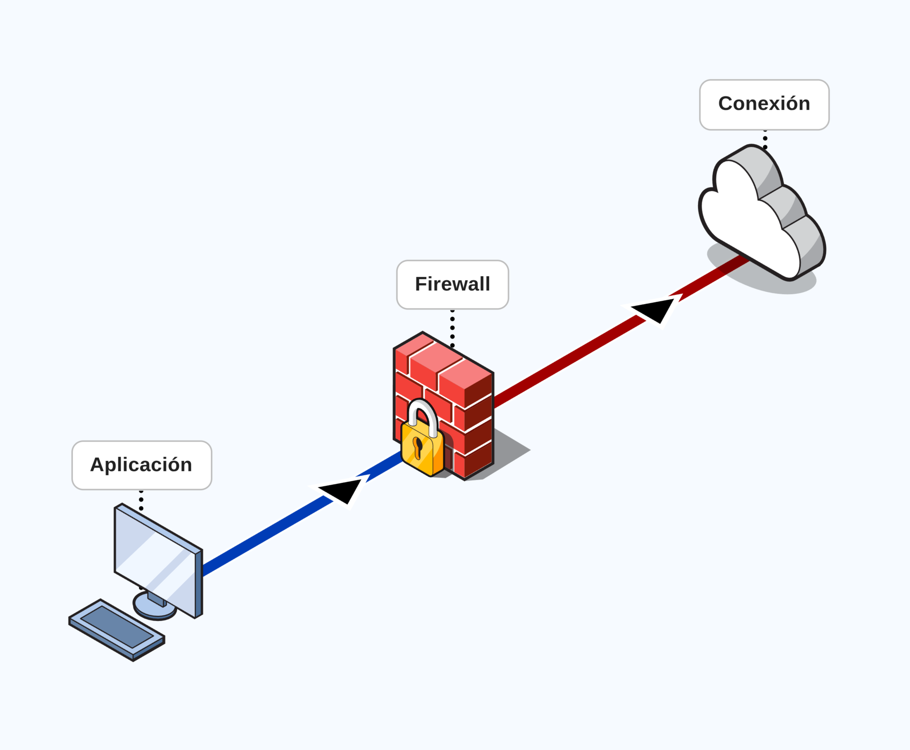

# Firewalls

Un firewall es un sistema de seguridad de red que monitorea y controla el tráfico de red entrante y saliente basado en reglas de seguridad predefinidas. Su propósito principal es establecer una barrera entre una red interna confiable y segura y redes externas no confiables, como Internet, para proteger los sistemas y datos contra accesos no autorizados, ataques cibernéticos y otras amenazas.

Un firewall puede tener reglas de entrada y salida que determinan qué tráfico está permitido o bloqueado. Estas reglas pueden basarse en varios criterios, como direcciones IP, puertos, protocolos y contenido del paquete.

La configuración de un firewall puede variar enormemente de un sistema operativo a otro, así como entre diferentes dispositivos de red. Algunos firewalls son software que se ejecuta en un sistema operativo, mientras que otros son dispositivos de hardware dedicados.

